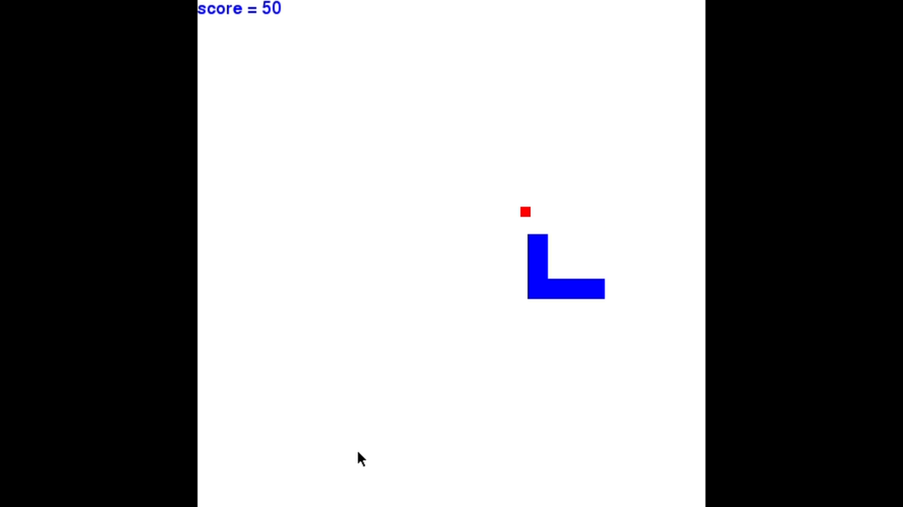

# SnakeGame
Classic snake game made with PyGame module in python.

## Features
- Score count
- Eat the food ("red rectangle") to increase the count
- Game over if tries to eat itself

## Demo
https://drive.google.com/file/d/1RzYi9y0VKKClcZxmbKh1AEgzWHxOWrJ4/view?usp=sharing

#Screenshots

## Authors

- [@DhruvDholakia](https://www.github.com/DhruvDholakiaCE)
